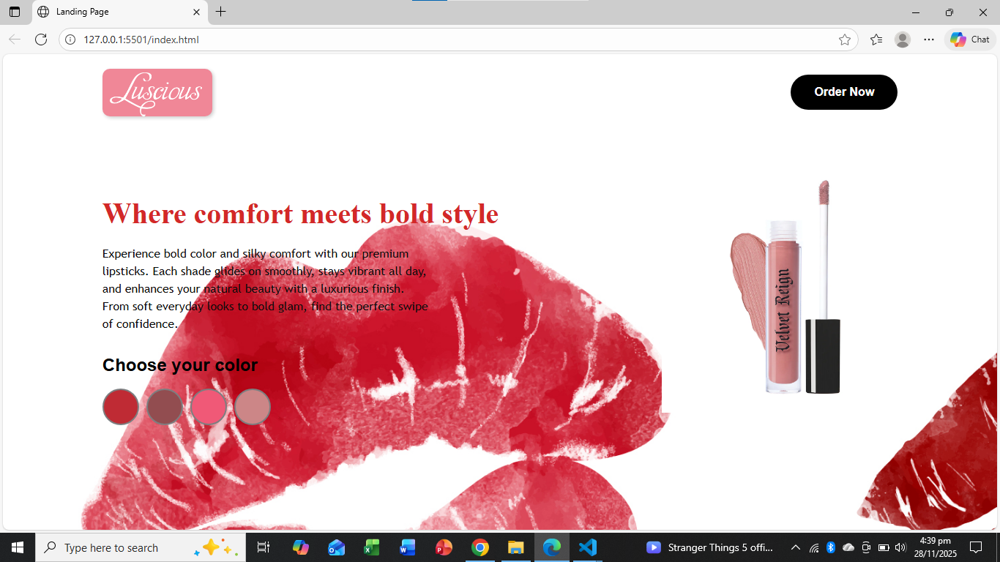

# Luscious – Lipstick Landing Page

A modern, visually appealing landing page for a premium lipstick brand, built using **HTML**, **CSS**, and **JavaScript**.  
This project focuses on clean UI/UX, elegant typography, and responsive layout to showcase cosmetic products effectively.

---

## 🚀 Features

- **Attractive Hero Section** with lipstick artwork and bold typography  
- **Product Highlight** featuring premium lipstick imagery  
- **Color Picker Section** allowing users to preview different lipstick shades  
- **Smooth UI Interactions** using lightweight JavaScript  
- **Fully Responsive** for mobile, tablet, and desktop screens  
- **Minimal & Elegant Aesthetic** suitable for beauty and cosmetic brands  

---

## 📸 Preview

Below is a preview of the landing page:
---
[https://lipstick-landing-page.netlify.app/](./Assets/landing-page.png)

---
## Screenshot




*(Replace screenshot.png with your actual screenshot image file.)*

---

## 🛠️ Tech Stack

- **HTML5** – semantic, structured markup  
- **CSS3** – custom styling & responsive design  
- **JavaScript (Vanilla JS)** – interactivity for color selection  
- **Google Fonts** – elegant typography  
- **Custom Assets** – product images & brush textures  

---

## 📂 Project Structure

```
.
├── index.html
├── style.css
├── script.js
└── assets/
    ├── images/

```

---

## 🔧 Setup & Usage

Follow these steps to run the project locally:

1. Clone the repository:
   ```bash
   git clone https://github.com/ayeshanoor-codes/lipstick-landing-page.git
   ```

2. Navigate to the folder:
   ```bash
   cd lipstick-landing-page
   ```

3. Open `index.html` in your browser  
   OR use Live Server in VS Code:
   - Right-click `index.html`
   - Select **Open with Live Server**

---

## 📱 Responsive Design

This landing page automatically adapts to:

- Mobile screens  
- Tablets  
- Laptops  
- Large desktops  

It uses custom media queries to maintain visual balance and spacing.

---

## 📝 License

This project is open-source and available under the **MIT License**.

---

## 💬 Contact

Created by **Ayesha Noor**  
For feedback or collaboration, feel free to reach out via GitHub.

